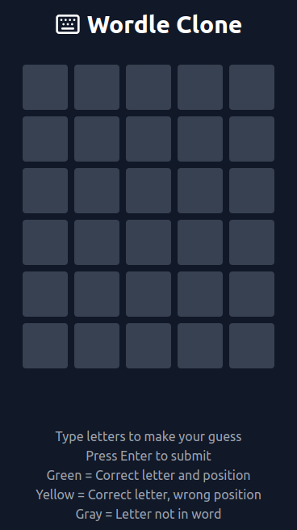

# Wordle Clone 🎮 🎯

Welcome to the Wordle Clone - a dynamic word-guessing game built with React, TypeScript, and Tailwind CSS, featuring real-time dictionary validation.

## Key Highlights

### Dynamic Word Generation with Dictionary Validation 📚

Experience the magic of real-time word validation! Each game features a randomly selected 5-letter word that's verified against a dictionary API, ensuring every challenge is both legitimate and engaging.

### Interactive Color-Coded Feedback System 🎨

Get instant visual feedback on your guesses:

- 🟩 Green: Letter is in the correct position
- 🟨 Yellow: Letter exists in the word but in wrong position
- ⬜ Gray: Letter is not in the word

### Responsive and Elegant Design 💫

A beautiful, minimalist interface that works seamlessly across all devices, featuring smooth animations and a dark theme for comfortable gameplay.

## Live Demo

[Play the Game](https://codewithaditisharma-wordle-clone.netlify.app/)

## Getting Started

Follow these steps to set up the project:

1. Clone the repository:
   \`\`\`bash
   git clone [repository-url]
   \`\`\`

2. Navigate to the project folder:
   \`\`\`bash
   cd wordle-clone
   \`\`\`

3. Install dependencies:
   \`\`\`bash
   npm install
   \`\`\`

4. Start the development server:
   \`\`\`bash
   npm run dev
   \`\`\`

## Features

### Game Mechanics

- 6 attempts to guess the correct 5-letter word
- Real-time dictionary validation for guesses
- Visual keyboard with color-coded feedback
- Game state management with win/lose conditions

### Technical Features

- Built with React and TypeScript for robust type safety
- Styled with Tailwind CSS for modern, responsive design
- Integration with Dictionary API for word validation
- Keyboard and touch input support

## Screenshots

## Contributing

Feel free to contribute by opening issues or submitting pull requests. Your feedback and contributions are highly appreciated!

### Development Guidelines

- Follow the existing code style and conventions
- Write clear commit messages
- Add appropriate comments for complex logic
- Test thoroughly before submitting PRs

## Tech Stack

- ⚛️ React 18
- 🔷 TypeScript
- 🎨 Tailwind CSS
- 🎯 Vite
- 🔍 ESLint
- 📦 Lucide React Icons

## License

This project is open source and available under the MIT License.

---

Happy Word Guessing! 🎮 ✨
